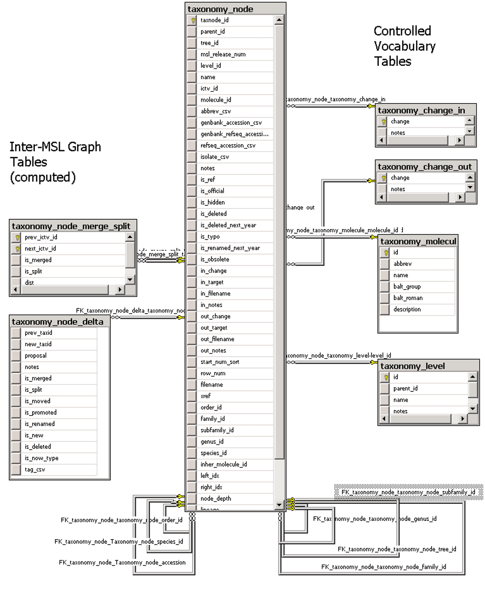
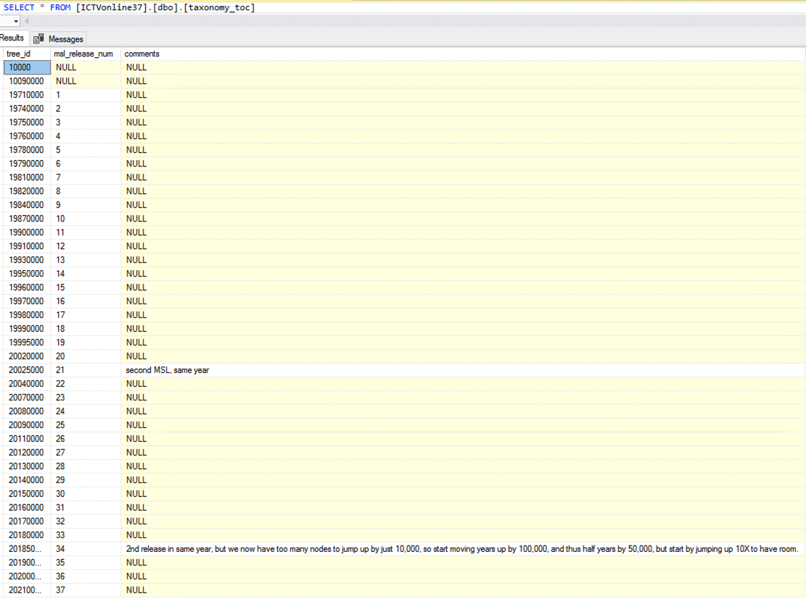
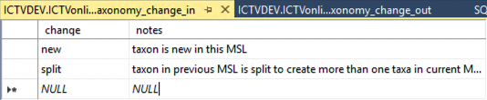
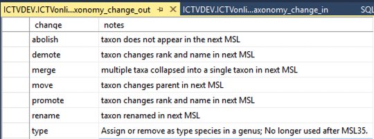
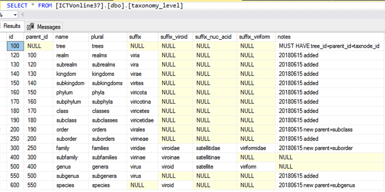
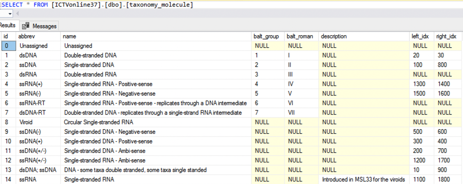
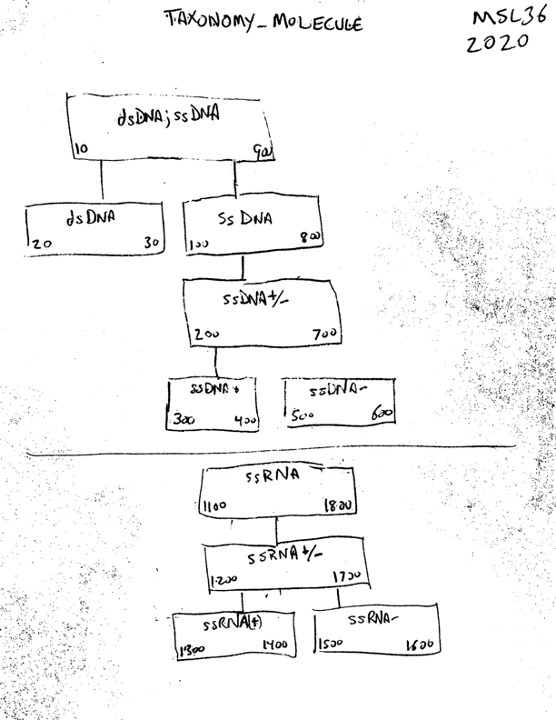
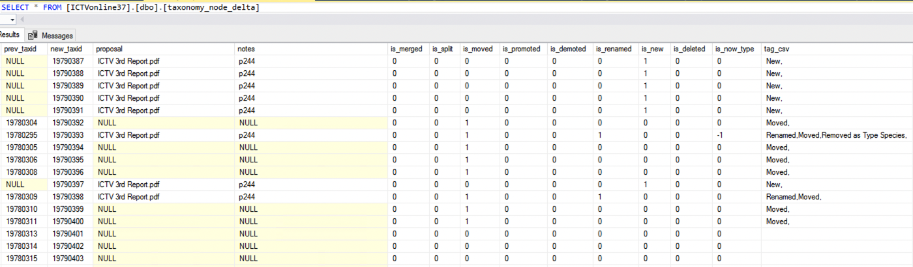
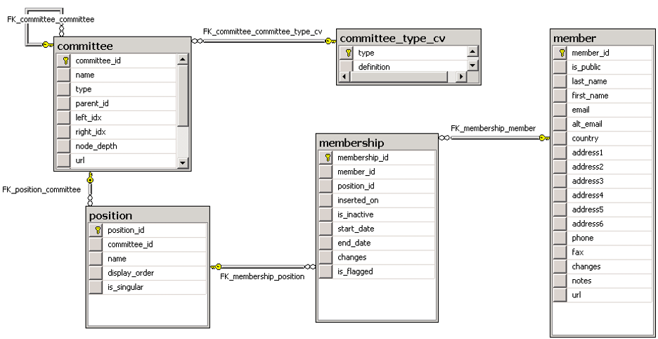

# ICTVonline SCHEMA

## Overview

These tables support the taxonomy database found at 
  * https://ictvonline.org/taxonomy/

 1. taxonomy - stores multiple taxonomy trees, linked across years, trees stored using "[nested set model](https://en.wikipedia.org/wiki/Nested_set_model)"
 1. virus properties - additional info about species, not linked to a specific year
 1. membership (obsolete) - used to store ICTV membership info and committee assignments
 1. ETL tables - tables used for loading and transforming data.
 1. Admin tables (obsolete)

## Taxonomy Trees: Primary Data & supporting controlled vocabularies



 1. [taxonomy_node](dbo.taxonomy_node.Table.sql) 
  * This table contains all the taxonomy hierarchies for all the years, and the information needed to link between years. 

| Column | Type | Key | Description |
| -----  | ---- | --- | ----------- |
| **>>>>>>>** | **>>>** | **>>>>>** | **primary taxonomy tree columns**  |
| taxnode_id | int | PK | uniquely identifies a taxon in a year |
| parent_id  | int | FK taxonomy_node.taxnode_id | defines the intra-year taxonomy heirarchy, must point to a taxon of a higher rank, the root node, "year", points to itself |
| tree_id    | int | FK taxonomy_toc.tree_id | defines the year (should match 1-1 with msl_release_num) |
| msl_release_num | int | FK taxonomy_toc.tree_id | defines the MSL (Master Species List), if this is an ICTV taxonomy (should match 1-1 with tree_id) |
| level_id   | int | FK taxonomy_level.id | defines rank taxa (Order, Family, Genus, ...) |
| name       | varchar | | Name of the taxon |
| **>>>>>>>** | **>>>** | **>>>>>** | **links to previous and next year**<BR>these are used to generate [taxonomy_node_delta] and [taxonomy_node_merge_split] tables  |
| ictv_id | int | FK taxonomy_node.taxnode_id | id of the first time a taxon created, links taxa across (rename,move,promote,demote), but not (split,merge) |
| in_change | varchar | | change relative to previous year: new or split |
| in_target | varchar | | (not used) |
| in_filename | varchar | | CSV of filename(s) of proposal(s) justifying the change(s) |
| in_notes | varchar | | |
| out_change | varchar | | change relative to next year: rename, move, promote, demote, merge |
| out_target | varchar | | name or lineage (semicolon separated names) of taxon in the next year |
| out_filename | varchar | | CSV of filename(s) of proposal(s) justifying the change(s) |
| out_notes | varchar | | |
| **>>>>>>>** | **>>>** | **>>>>>** | **taxon attributess**  |
| molecule_id | int | FK taxonomy_molecule.id| type of genome |
| start_sort_num | int  | | offset within name to find a number to be parsed and used to override alphabetical sorting of name - mostly applies when there are more than 9 of something, and an alphabetical sort would place 10 before 2. |
| abbrev_csv | nvarchar | | abbreviations for the virus |
| genbank_accession_csv | nvarchar | | Genbank accession number(s),comma or semicolon separated, optionally with "segment_name:" prefix  |
| genbank_refseq_accession_csv | nvarchar | | (not used)|
| refseq_accession_csv | nvarchar | | RefSeq accesion number (not used after MSL29)|
| isolate_csv | nvarchar | | comma or semicolon separated list of isolate names|
| notes | nvarchar | | notes to the db curator |
| is_ref | int | (0,1) | aplies only to species; flags the reference species in a genus; not used after MSL 35 |
| is_official | int | (0,1) | not used after MSL22 |
| is_hidden | int | (0,1) | do not display the taxon. Mostly used to mark the root node of each year's taxonomy, but sometimes used to hide erroneous records.|
| is_deleted | int | (0,1) | used in conjunction with ```is_hidden``` |
| is_deleted_next_year | int | (0,1) | obsolete |
| is_typo | int | (0,1) | used in conjunction with ```is_hidden``` |
| is_renamed_next_year | int | (0,1) | obsolete |
| is_obsolete | int |  (0,1) | obsolete (no longer used) |
| filename | varchar | | document this record was loaded from, usually proposal .xlsx file, or merge thereof |
| row_num | int | | row number in ```filename``` original document |
| xref | varchar | | used in ICTVdb taxonomy (tree_id=10090000) to store accession string for ICTVdb database (obsolete) |
| **>>>>>>>** | **>>>** | **>>>>>** | **following columns are cached values set by a trigger**<BR>[TR_taxonomy_node_UPDATE_indexes](dbo.TR_taxonomy_node_UPDATE_indexes.Trigger.sql),<BR> which in turn calls the stored procedure [taxonomy_node_compute_indexes](dbo.taxonomy_node_compute_indexes.StoredProcedure.sql) to do the actual update**. |
| left_idx,right_idx,node_depth | int | | "[nested set model](https://en.wikipedia.org/wiki/Nested_set_model)" indicies: ordering in a depth-first traversal of the MSL taxonomy for each year. Used for parent-of/child-of queries |
| lineage | varchar | | ";"-separated list of names based on parent_id | 
| inher_molecule_id | int | FK taxonomy_molecule.id | molecule ID of closest ancestor with a molecule_id setting |
| {rank}_id | int | FK taxonomy_node.taxnode_id | based on parent_id & level_id, ids of higher-ranked taxa in which this taxon is contained
| {rank}_kid_ct | int | number of taxa of {rank} that are direct children of this taxon |
| {rank}_desc_ct | int | number of all taxa of {rank} that are in this taxon (desc=descendent) |
| taxa_kid_cts | varchar | | English summary of {rank}_kid_ct (eg, "2 kingdoms, 2 families, 4 genera") ||
| taxa_desc_cts | varchar | | English summary of {rank}_desc_ct (eg, "2 kingdoms, 6 phyla, 2 subphyla, 21 classes, 30 orders, 8 suborders, 117 families, 53 subfamilies, 1019 genera, 84 subgenera, 4317 species") ||
| **>>>>>>>** | **>>>** | **>>>>>** | **computed columns** |  
| cleaned_name | varchar | | ```name``` with any diacritical marks removed | 
| cleaned_problems | varchar | | what diacritical marks were removed from ```name```  | 
| flags | varcahr | | semi-colon separated list of is_XXX flags that are set |
| _numKids | int | | number of sub-taxa (recursive) | 
| _out_target_parent | varchar | | if ```out_target``` is a ;-separated lineage, all but the last name in the lineage |
| _out_target_name | varchar | | if ```out_target``` is a ;-separated lineage, only last name in the lineage |

 1. Supporting TABLES that define years and controled vocabularies:
  * [taxonomy_toc](dbo.taxonomy_toc.Table.sql) - Table of Contents 
    * defines MSL release numbers and tree IDs. Must have a row for each taxonomy stored in ```taxonomy_node```. 
    * data glympse 
  * [taxonomy_change_in](dbo.taxonomy_change_in.Table.sql) - defines values for ```taxonomy_node.in_change```
    * data glympse 
  * [taxonomy_change_out](dbo.taxonomy_change_out.Table.sql) - defines values for ```taxonomy_node.out_change```
    * data glympse 
  * [taxonomy_level](dbo.taxonomy_level.Table.sql) - defines ranks
    * defines values for ```taxonomy_node.level_id```
    *  maps level_id to rank name (Order, Family, Genus,...)
    * defines allowable suffixes per
    * data glympse 
  * [taxonomy_molecule](dbo.taxonomy_molecule.Table.sql) 
    * defines values for ```taxonomy_node.molecule_id```. 
    * data glympse 
    * Also defines a hierarchy for molecule types using : 

##  Cache Tables

these store data pre-computed from taxonomy_node, which makes the queries that serve the website possible in real time. 
  * [taxonomy_node_delta](dbo.taxonomy_node_delta.Table.sql) 
    * link the taxa of one year in ```taxonomy_node```, to the taxa of the next year, annotate what changed and why
    * computed by [dbo.rebuild_delta_nodes.StoredProcedure.sql](dbo.rebuild_delta_nodes.StoredProcedure.sql) for recent MSLs, hand-built for some of the older ones
    * 
  * [taxonomy_node_merge_split](dbo.taxonomy_node_merge_split.Table.sql)
    * link each taxa in ```taxonomy_node``` to all previous and future versions of that taxon. 
    * This is essentially a transitive closure of the ```taxonomy_node_delta```.
    * computed by Stored Procedure [dbo.rebuild_node_merge_split.StoredProcedure.sql](dbo.rebuild_node_merge_split.StoredProcedure.sql)

## Supporting VIEWS that simplify access

  * [MSL_export_fast](dbo.MSL_export_fast.View.sql) - quickly export the MSL for a year. For full MSL metadata, use the StoredProcedure [MSL_export_official](dbo.MSL_export_official.StoredProcedure.sql)
  * [taxonomy_node_dx](dbo.taxonomy_node_dx.View.sql) - join of taxonomy_node through taxonomy_node_delta (twice) with previous and next year's taxonomies.
  * [taxonomy_node_names](dbo.taxonomy_node_names.View.sql) - join of taxonomy_node with controlled vocabulary tables, so in addition to "genus_id" actually has "genus" with the actual name of the genus.
  * [taxonomy_node_x](dbo.taxonomy_node_x.View.sql) - join of taxonom_node thorugh ```taxonomy_node_merge_split```, to list all previous and future versions of this taxon
  * [taxonomy_toc_dx](dbo.taxonomy_toc_dx.View.sql) - join of taxonomy_toc with itself to link current year to previous year, used for lookup of previous year's tree_id
  * [view_taxa_level_counts_by_release](dbo.view_taxa_level_counts_by_release.View.sql) - per-MSL (year) counts of all ranks: realms through species. 
  * [view_taxonomy_stats](dbo.view_taxonomy_stats.View.sql) - (no longer used after MSL32, when realm and sub{ranks} were added) per-MSL counts for orders, familes, subfamilies, genera, species

##  Virus isolate tables - these are additional data linked to the species described in taxonomy_node, but not linked to the specific year. 

There are fields in the main ```taxonomy_node``` table for many of these attributes. 
When new taxa are loaded from ICTV proposals, the information is loaded into ```load_next_msl``` and from there into ```taxonomy_node```, and from there into these tables. It is then maintained in these tables, without going back to update the version in ```taxonomy_node```. 

### Current active table

  * [virus_isolates](dbo.virus_isolates.Table.sql)
        * generates the "member species" table on the web page for each genus
	   * eg [hepacivirus](https://talk.ictvonline.org/ictv-reports/ictv_online_report/positive-sense-rna-viruses/w/flaviviridae/362/genus-hepacivirus)
        * lists exemplar & additional species
        * updated by study groups, posted immediately
        * lists additional isolates
  * [virus_prop](dbo.virus_prop.Table.sql)
        * Additional metadata on viruses, not currently up to date, but will be updated again in the future
  * [VMR-new](dbo.VMR-new.Table.sql)
        * This documents the various isolates and clades that are found under the species level. 

### older versions and ETL tables
  * [virus_isolates_051420](dbo.virus_isolates_051420.Table.sql)
  * [virus_isolates_051821](dbo.virus_isolates_051821.Table.sql)
  * [virus_isolates_072021](dbo.virus_isolates_072021.Table.sql)
  * [virus_isolates_080120](dbo.virus_isolates_080120.Table.sql)
  * [virus_isolates_093019](dbo.virus_isolates_093019.Table.sql)
  * [virus_isolates_112321](dbo.virus_isolates_112321.Table.sql)
  * [virus_isolates_120219](dbo.virus_isolates_120219.Table.sql)
  * [virus_isolates_220319](dbo.virus_isolates_220319.Table.sql)
  * [virus_isolates_load](dbo.virus_isolates_load.Table.sql)
  * [vmr_load](dbo.vmr_load.Table.sql)

## ETL/Load tables & Views

### Current year/MSL/taxonomy
  * [load_next_msl](dbo.load_next_msl.Table.sql) - most recent/active load. Contains the list of changes between previous and current MSL, as loaded from the merged proposal spreadsheets
  * [load_next_msl_isOk](dbo.load_next_msl_isOk.View.sql) (View) - filters out any rows of ```[load_next_msl]``` with ```WHERE isOK IS NOT NULL```
### Previous years
  * [load_next_msl_28](dbo.load_next_msl_28.Table.sql)
  * [load_next_msl_29](dbo.load_next_msl_29.Table.sql)
  * [load_next_msl_30](dbo.load_next_msl_30.Table.sql)
  * [load_next_msl_31](dbo.load_next_msl_31.Table.sql)
  * [load_next_msl_32](dbo.load_next_msl_32.Table.sql)
  * [load_next_msl_33](dbo.load_next_msl_33.Table.sql)
  * [load_next_msl_34a](dbo.load_next_msl_34a.Table.sql)
  * [load_next_msl_34b](dbo.load_next_msl_34b.Table.sql)
  * [load_next_msl_35](dbo.load_next_msl_35.Table.sql)
  * [load_next_msl_36](dbo.load_next_msl_36.Table.sql)
  * [load_next_msl_scList](dbo.load_next_msl_scList.Table.sql) 
  * [load_next_msl_taxonomy_31](dbo.load_next_msl_taxonomy_31.Table.sql)
  * [load_next_msl_tpList](dbo.load_next_msl_tpList.Table.sql)
  * [load_next_msl_unicode](dbo.load_next_msl_unicode.Table.sql)


## Obsolete
### Load/ETL (obsolete)
  * [queue_delta](dbo.queue_delta.Table.sql)
  * [queue_patch](dbo.queue_patch.Table.sql)
  * [log_change](dbo.log_change.Table.sql)

### Membership (obsolete)



#### Tables
  * [committee](dbo.committee.Table.sql)
  * [committee_type_cv](dbo.committee_type_cv.Table.sql)
  * [membership](dbo.membership.Table.sql)
  * [member](dbo.member.Table.sql)
  * [position](dbo.position.Table.sql)
#### Views
  * [view_membership_committee_with_subchairs](dbo.view_membership_committee_with_subchairs.View.sql)
  * [view_membership_committee_with_submembers](dbo.view_membership_committee_with_submembers.View.sql)
  * [view_membership_x](dbo.view_membership_x.View.sql)

### ICTVdb Linkage (obsolete)
#### Tables
  * [ictvdb_index](dbo.ictvdb_index.Table.sql)
  * [ictvdb_sun_ah](dbo.ictvdb_sun_ah.Table.sql)
#### Views
  * [ictvdb_family](dbo.ictvdb_family.View.sql)
  * [ictvdb_genus](dbo.ictvdb_genus.View.sql)
  * [ictvdb_order](dbo.ictvdb_order.View.sql)
  * [ictvdb_species](dbo.ictvdb_species.View.sql)
  * [ictvdb_subfamily](dbo.ictvdb_subfamily.View.sql)


